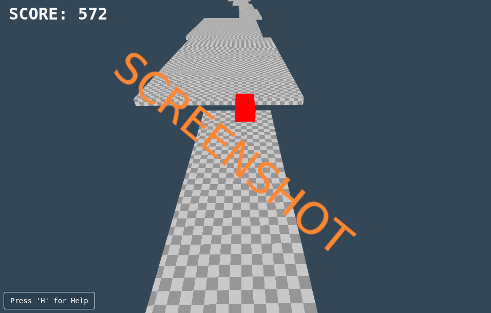

# js_roadsky

# WebGL Sky Driver 🛫✨

A lightweight WebGL driving/runner prototype rendered on HTML5 Canvas with a simple HUD overlay and a toggleable Help/Settings menu. Uses **gl‑matrix** for matrices/vectors and generates a procedural platform “track” you jump and steer across.

> **Live tech:** WebGL 1.0, HTML5 Canvas 2D (HUD), vanilla JS, gl-matrix 2.8.1

## Screenshots


---

## 🎮 Features

- **Procedural track generation** — deterministic with a seed, varied widths, gaps, and subtle elevation/side shifts.
- **Two camera styles**
  - **Dynamic (Default):** camera “swings” sideways when steering for speed sensation.
  - **Static:** steady follow cam behind the car.
- **HUD overlay** — score, control hints, and help toggle.
- **In‑game Help/Settings (H)** — switch camera style and see controls.
- **Simple physics** — gravity, jumping when grounded, forward thrust, lateral strafe.
- **Compact shaders** — textured geometry with a checkerboard track and a solid‑color car.
- **Responsive canvas** — resizes to viewport.

---

## ⌨️ Controls

- **W / ↑ Up:** Accelerate
- **A / ← Left:** Steer Left
- **D / → Right:** Steer Right
- **Space:** Jump
- **H:** Toggle Help / Settings

> Tip: The default camera mode is **Dynamic**. Switch to **Static** in the Help menu if you prefer a stable chase cam.

---

## 🗂 Project Structure

```text
.
├─ index.html        # Loads gl-matrix, canvases, Help/Settings UI, and script.js
├─ style.css         # Layout + Help/Settings modal + HUD text styling
└─ script.js         # WebGL setup, shaders, track & cube geometry, gameplay loop
```

---

## 🚀 Quick Start (Local)

WebGL content must be served from a local server (file:// can break textures, timing, etc.).

### Option A — Python
```bash
# Python 3
python3 -m http.server 8000
# then open: http://localhost:8000/
```

### Option B — Node (http-server)
```bash
npm i -g http-server
http-server -p 8000
# then open: http://localhost:8000/
```

---

## 🔧 Installation & Dependencies

- **gl-matrix 2.8.1** (CDN): already included in `index.html`
  ```html
  <script src="https://cdnjs.cloudflare.com/ajax/libs/gl-matrix/2.8.1/gl-matrix-min.js"></script>
  ```

No bundlers required. Just open via a local server and go.

---

## 🧠 How It Works (High Level)

- **Geometry:** `createCubeGeometry()` returns interleaved positions + UVs (x,y,z,u,v). Track is built from many cubes (platforms).
- **Procedural Track:** `createTrack(length, seed)` assembles platforms with controlled gaps and offsets; `buildTrackGeometry()` batches into a single VBO.
- **Shaders:** Extremely small vertex/fragment pair that handles a repeating UV checkerboard on the track and a solid color for the car.
- **Camera:** In **Dynamic** mode, `cameraSway` lerps toward an offset derived from steering sign; in **Static** mode it stays centered.
- **Physics:** Ground check is AABB‑ish against platform bounds; gravity is applied if not grounded; space to jump.
- **HUD:** A separate 2D canvas (`hudCanvas`) renders score and control hints each frame.
- **Pause/Help:** The `H` key toggles the modal and pauses the update loop to avoid large delta jumps.

---

## 🧪 Developer Notes

- Key gameplay constants live at the top of `script.js`:
  ```js
  const GRAVITY = 25.0;
  const FORWARD_SPEED = 25.0;
  const STRAFE_SPEED = 15.0;
  const JUMP_STRENGTH = 10.0;
  ```
- Track look:
  ```js
  // Change checker size for texture density
  createCubeGeometry(width, height, depth, /* checkSize= */ 0.6);
  ```
- Seeding:
  ```js
  // Example fixed seed
  trackData = createTrack(100, 12345);
  ```

---

## 🧭 Troubleshooting

- **Blank screen / “WebGL not supported”:** Try a modern browser (Chrome/Firefox). Ensure hardware acceleration is enabled.
- **Works over file:// but textures look odd:** Always serve via `http://localhost` to avoid CORS/tex parameter issues.
- **Nothing moves after closing Help:** The loop is paused while the Help is open. Press **H** again to resume.
- **Falling forever:** This is normal—`respawnPlayer()` resets when Y < -20. If it doesn’t, check console for errors.

---

## 🗺️ Roadmap / Ideas

- Add proper collision normals & slopes.
- Separate car model (body + wheels) with simple suspension.
- Gamepad input + on‑screen join prompt.
- Per‑platform difficulty tags (ice/boost/bounce).
- Timer, best distance, and seed sharing.
- Post‑processing (fog, vignette) for depth perception.

---

## 📄 License

MIT — feel free to use, modify, and share. Attribution is appreciated!

---

## 🙌 Credits

- **gl-matrix** by Brandon Jones and Colin MacKenzie IV.
- You and your wild ideas. AMIGAAA! 🫡
